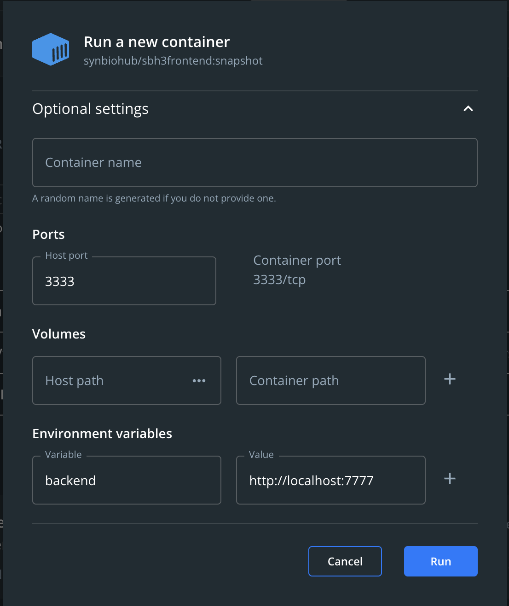

## Getting Started

Note: The following instructions are for installing the frontend of SBH3, NOT THE BACKEND. For information on
getting the SBH3 backend setup locally, please see the README in the [/backend](../backend/README.md) directory of this repo.

### Manual Installation

Prerequisites - Install following software:

- [Node & NPM](https://docs.npmjs.com/downloading-and-installing-node-js-and-npm)
- [Yarn](https://classic.yarnpkg.com/lang/en/docs/install)

Download or clone the repository on github. Then, make sure to install
all dependencies by running the following command in your terminal in the /frontend directory:

```bash
yarn install
# or
npm install
```

In order to connect the frontend to your backend, go to the next.config.js file.
Then, change the env backendUrl variable to your backend's url.

Finally, run the development server:

```bash
npm run dev
# or
yarn dev
```

### Installing and running through Docker

Prerequisites - Install following software:

- [Docker](https://www.docker.com/)

Installation steps:

1. Open terminal
2. Pull frontend image from docker hub by running `docker pull synbiohub/sbh3frontend:snapshot` in terminal
3. Open [docker desktop](https://docs.docker.com/desktop/)
4. Confirm that you see the `synbiohub/sbh3frontend` image in the `images` tab:
   <br />
   <br />
   
   <br />
   <br />
5. Hover mouse over the image and click `Run`
   <br />
   <br />
   
   <br />
   <br />
6. Expand `Optional settings` dropdown BEFORE clicking the `Run` button
7. In `Optional settings`, enter `3333` in the "Host port" text field
8. In `Optional settings`, add an environment variable with "Variable" `backend` and "Value" `[backend address of SBH w/o ending slash]`
   <br />
   <br />
   
   <br />
   <br />
9. Click `Run`
10. Go to the `Containers` section of docker desktop and verify that a container with `IMAGE` = `synbiohub/sbh3frontend:snapshot`, `STATUS` = `Running` and `PORT(S)` = `3333` exists
    <br />
    <br />
    
    <br />
    <br />
11. Open [http://localhost:3333](http://localhost:3333) with your browser to see the frontend up and running :)

Note: For easier setup, these instructions are catered towards users of Docker desktop, which is normally installed along with Docker.
Docker desktop is not necessary to run SBH3's frontend with Docker. All of the actions above that involve Docker desktop have corresponding Docker commands that can be executed in the terminal.

## Developer Notes

Each component/page in SynBioHub should have a header which dicatates its purpose.

This app utilizes Redux to handle global application state and simplify the passing of
deeply nested props. To view how this application uses Redux, see the /redux directory.

This app uses eslint that is set up for React/Next.js code. To run the linter, navigate to
the frontend directory in your terminal (the directory this README is in) and run the command:

```
npm run lint
```

If you'd like to format all code and fix minor styling errors (recommened before pushing anything
to the directory), run the command:

```
npm run lint.fix
```

## Next.js Resources

To learn more about Next.js, take a look at the following resources:

- [Next.js Documentation](https://nextjs.org/docs) - learn about Next.js features and API.
- [Learn Next.js](https://nextjs.org/learn) - an interactive Next.js tutorial.
